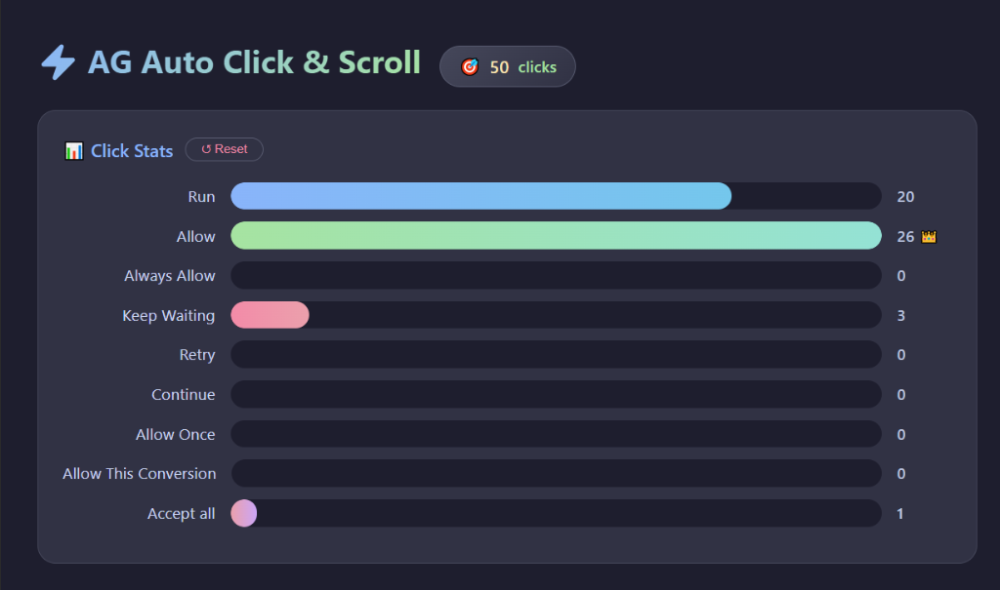
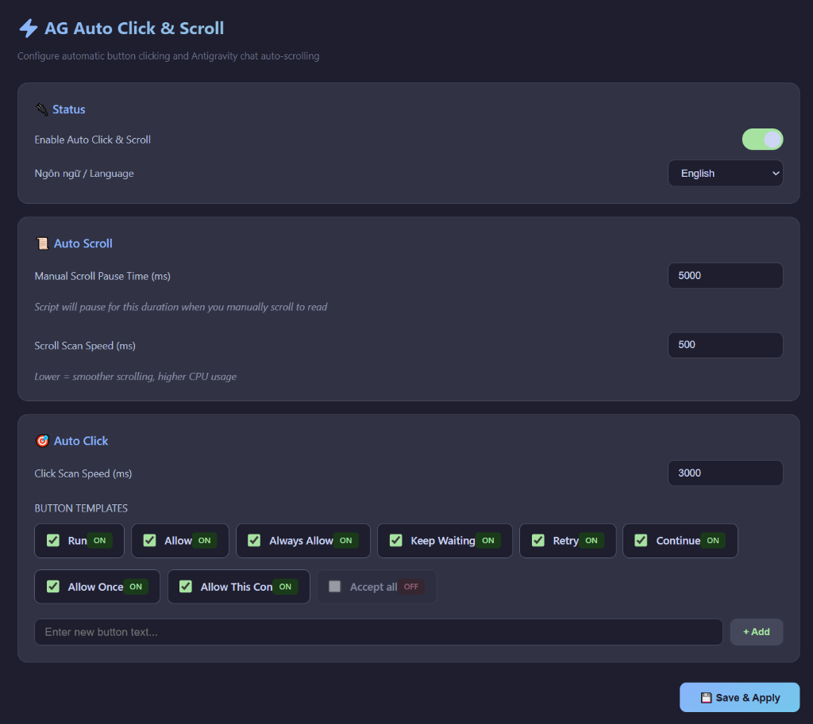

## Antigravity vừa update? Không cần lo!

> Từ **v5.5.0**, extension tự động phát hiện khi Antigravity cập nhật phiên bản mới và **tự inject lại script** mà không cần bất kỳ thao tác thủ công nào. Chỉ cần cài extension một lần — mọi thứ tự động từ A đến Z!

---

## ☕ Ủng hộ tác giả

Nếu extension giúp ích cho bạn, mời tác giả một ly cà phê nhé! ☕  
Quét mã QR bên dưới qua **Momo, VietQR hoặc Napas 247**:

  

> 🙏 Mọi sự ủng hộ đều là động lực để mình tiếp tục phát triển extension miễn phí cho cộng đồng!

---

# AG Auto Click & Scroll v6.9

**Extension tự động nhấn nút Run, Allow, Accept all và cuộn khung chat Antigravity.**  
Thiết kế thông minh — chỉ click **nút approval** (có nút Reject bên cạnh), không click nhầm UI khác.

> Hỗ trợ **Windows & Linux** — tự động xử lý quyền ghi file trên mọi hệ điều hành.

---

## Có gì mới trong v6.6

### Fix thông báo "Corrupt Installation"
- Tự động cập nhật checksums sau khi inject → xóa hoàn toàn cảnh báo "corrupt"
- Tự reload sau update checksums + tự đóng notification nếu vẫn hiện
- Tự phát hiện extension upgrade → re-inject script mới tự động

### Click Stats Dashboard
- Bảng thống kê click realtime ngay trong Settings với progress bar so sánh
- Nút click nhiều nhất tự động nhận vương miện
- Badge tổng số click ngay cạnh tiêu đề
- Nút Reset xóa toàn bộ thống kê, đồng bộ cả autoScript và extension host
- Stats tự cập nhật mỗi 2 giây, bar có animation mượt
- Lưu thống kê qua restart, chỉ mất khi ấn Reset

### Native Dialog Auto-Click (Win32)
- Tự động nhấn **Keep Waiting** trong dialog "window not responding" bằng Win32 API
- Quét mọi cửa sổ Windows để tìm nút Keep Waiting, không phụ thuộc title dialog
- Đếm số lần click vào stats, merge với stats từ autoScript

### Toggle Settings Panel
- Click status bar lần 1 → mở Settings, lần 2 → đóng Settings
- Cả 2 nút "Accept ON" và "Scroll ON" đều hỗ trợ toggle

### Display Name Mapping
- Hiển thị tên đầy đủ (VD: "Allow This Conversion") mà không ảnh hưởng logic click
- Tên nội bộ giữ nguyên để đảm bảo pattern matching chính xác

---

## Tính năng chính

| Tính năng | Mô tả |
|-----------|-------|
| **Auto Click** | Tự động nhấn Run, Allow, Always Allow, Accept all, Keep Waiting... |
| **Auto Scroll** | Cuộn khung chat xuống cuối để không bỏ lỡ nội dung mới |
| **Click Stats** | Bảng thống kê click realtime với progress bar và badge |
| **Instant Toggle** | Gạt switch ON/OFF → áp dụng tức thì, không cần Save hay Reload |
| **Tắt/Bật riêng** | Accept và Scroll có toggle riêng, hoạt động độc lập |
| **HTTP Live Sync** | Settings cập nhật realtime qua HTTP server nội bộ |
| **Safe Click** | Chỉ click nút approval (có Reject bên cạnh), không phá UI |
| **Diff Protection** | KHÔNG click Accept Changes/Accept All trong diff/merge editor |
| **Settings UI** | Giao diện đẹp — bật/tắt từng nút, chỉnh tốc độ, đa ngôn ngữ |
| **Dual Status Bar** | Hiện Accept ON/OFF và Scroll ON/OFF riêng biệt, màu xanh/đỏ |

---

## Danh sách nút hỗ trợ

Mặc định **ON**: `Run` · `Allow` · `Always Allow` · `Keep Waiting` · `Retry` · `Continue` · `Allow Once` · `Allow This Con`

Mặc định **OFF**: `Accept all` (bật thủ công khi cần)

> Bạn có thể thêm nút tùy chỉnh hoặc bật/tắt từng nút trong Settings.

---

## Cách sử dụng

### Cài đặt
1. Mở Antigravity / VS Code
2. `Ctrl+Shift+P` → `Extensions: Install from VSIX...`
3. Chọn file `.vsix` → Cài đặt → **Reload Window**
4. Extension tự inject script + **auto-reload** lần đầu

> **Linux**: lần đầu inject sẽ hiện hộp thoại nhập mật khẩu — chỉ cần nhập 1 lần.

### Mở Settings
- Click **"Accept ON"** hoặc **"Scroll ON"** trên Status Bar (góc dưới phải)
- Hoặc `Ctrl+Shift+P` → `AG Auto: Open Settings`

### Sử dụng
- **Toggle ON/OFF**: Gạt switch → tức thì, không cần Save
- **Đổi patterns/settings**: Chỉnh thông số → nhấn **Save & Apply**
- **Reload thủ công**: Nhấn nút **Reload** khi cần

### Gỡ bỏ
`Ctrl+Shift+P` → `AG Auto: Disable` → **Reload Window**

---

> **Safe Click**: Script chỉ click nút nằm trong approval dialog (có nút Reject/Deny/Cancel bên cạnh). Không click nhầm diff editor, navigation, sidebar, hay dialog khác.

---

## Click Stats

## Giao diện Settings

---

## Changelog

### v6.9.0 (Latest)
- **Fix 'Corrupt Installation' Warning** — Tự động cập nhật checksums trong `product.json` sau khi inject script, xóa hoàn toàn cảnh báo "Your Antigravity installation appears to be corrupt"
- **Auto-Reload sau Update** — Tự reload sau khi cập nhật checksums, đảm bảo không hiện cảnh báo
- **Auto-Dismiss Notification** — Tự đóng notification "corrupt" nếu vẫn xuất hiện (backup)

### v6.3.0
- **Click Stats Dashboard** — Thống kê click realtime, progress bar, vương miện, badge
- **Native Dialog Auto-Click** — Tự nhấn "Keep Waiting" qua Win32 API
- **Persistent Stats** — Lưu thống kê qua restart
- **Toggle Panel** — Click status bar để mở/đóng Settings
- **Display Name Mapping** — Hiển thị tên đầy đủ cho patterns

### v5.8.0
- **SSH Remote Support** — Hoạt động trên Remote-SSH
- **Async HTTP Polling** — Không block UI
- **Auto-stop polling** — Dừng sau 5 lỗi liên tiếp

### v5.5.0
- **Auto-fix sau update** — Tự inject lại khi Antigravity update

### v5.4.0
- **Smart Auto Scroll** — Chỉ cuộn trong khung chat chính
- **Jitter-free Scrolling** — Dừng cuộn khi chạm đáy

### v5.1.0
- **Linux/macOS support** — Auto-elevation
- **Diff Protection** — Không click diff editor
- **Smart Commands Loop** — Tôn trọng pattern settings
- **Status Bar Adjacent** — 2 items liền kề

### v5.0.0
- Instant Toggle, Scroll Toggle, HTTP IPC, Dual Status Bar
- UI nâng cấp, Auto-inject + Auto-reload

### v4.x
- Auto Click, Auto Scroll, Settings UI đa ngôn ngữ, Safe Click

---

## License

MIT © [Zixfel](https://github.com/zixfelw)
